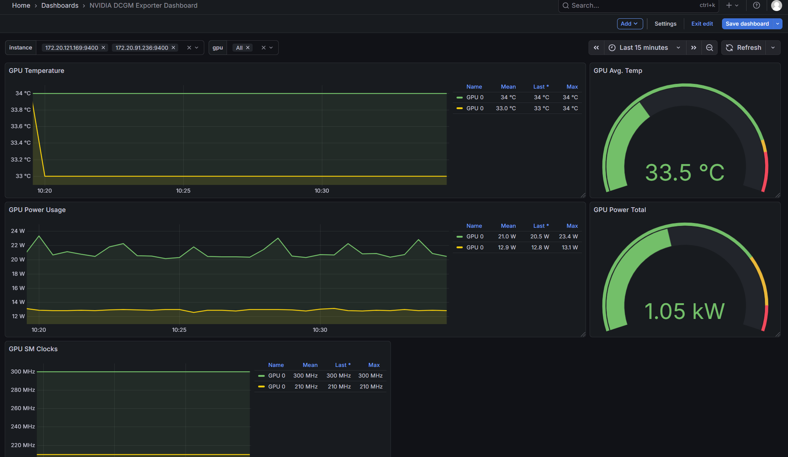

# Learn about NVIDIA GPU metrics to optimize GPU performance and utilization on the Taichu platform.

Efficient placement and optimization of GPU workloads require detailed visibility into GPU resource utilization and performance.

Taichu provides managed GPU metrics with automated collection and exposure of GPU utilization, memory, and performance data across NVIDIA GPU–enabled node pools. This enables platform administrators to optimize cluster resources and allows developers to tune and debug GPU workloads with minimal manual instrumentation.

In this article, you’ll learn about GPU metrics collected by the NVIDIA Data Center GPU Manager (DCGM) exporter on Taichu’s GPU-enabled Kubernetes platform.

## Prerequisites

- A Taichu Kubernetes cluster with NVIDIA GPUs properly configured and schedulable.
- A sample GPU workload to demonstrate GPU metrics.

## Understanding GPU Metrics (Taichu Platform)
### GPU Utilization Metrics

GPU utilization metrics show the percentage of time the GPU’s cores are actively processing work. High values indicate the GPU is heavily used, which is generally desirable for workloads like training or data processing. Interpretation should consider the workload type: AI training typically maintains high utilization, while inference workloads may have intermittent utilization due to bursty traffic.

### Memory Utilization

Shows the percentage of GPU memory in use. High memory usage without high GPU utilization can indicate memory-bound workloads where the GPU is waiting on memory transfers. Low memory usage with low GPU utilization may suggest that the workload is too small to fully leverage the GPU.

### Temperature and Power Metrics

- GPU Temperature: Shows the operating temperature of the GPU. Sustained high temperatures may trigger throttling. Interpret relative to the GPU’s thermal limits and cooling capacity.

-Power Usage: Shows instantaneous power draw. Comparing to the GPU’s TDP helps understand if the GPU is fully utilized. Sudden drops may indicate throttling or underutilization.

### Error and Reliability Metrics

- Retired Pages and XID Errors: Track GPU memory errors and critical failures. Frequent occurrences require attention for long-running workloads.

### Interpretation Guidance

GPU metrics should always be interpreted in the context of your workload on Taichu. High compute workloads should ideally show high GPU and SM utilization, high memory bandwidth, stable temperatures below throttling thresholds, and power draw near but below TDP.

Memory-bound workloads may show high memory usage with lower compute utilization. Anomalies such as low utilization with high temperature or power draw often indicate throttling, inefficient scheduling, or system-level bottlenecks.

Monitoring trends over time rather than single snapshots is critical. Comparing metrics across multiple GPUs helps identify outliers or misbehaving devices.

### Common GPU Metrics
| Metric Name              | Meaning                                  | Typical Range / Indicator | Usage Tip                                                    |
| ------------------------ | ---------------------------------------- | ------------------------- | ------------------------------------------------------------ |
| DCGM_FI_DEV_GPU_UTIL     | GPU utilization (% of active cores)      | 0–100% (higher is better) | Monitor per node and per workload; low values may indicate CPU or I/O bottlenecks |
| DCGM_FI_DEV_SM_UTIL      | Streaming Multiprocessor efficiency      | 0–100%                    | Low values with high memory usage indicate memory-bound workloads |
| DCGM_FI_DEV_FB_USED      | Framebuffer memory used (bytes)          | 0 to total memory         | Track per workload memory usage to avoid OOM errors          |
| DCGM_FI_DEV_FB_FREE      | Free GPU memory (bytes)                  | 0 to total memory         | Useful for scheduling and avoiding memory overcommit         |
| DCGM_FI_DEV_MEMORY_UTIL  | Memory utilization (%)                   | 0–100%                    | Combine with GPU/SM utilization to detect memory-bound workloads |
| DCGM_FI_DEV_MEMORY_CLOCK | Current memory clock (MHz)               | 0 to max memory clock     | Low values under high memory usage may indicate throttling   |
| DCGM_FI_DEV_POWER_USAGE  | Instantaneous power usage (Watts)        | 0 to TDP                  | Drops during high utilization may indicate throttling        |
| DCGM_FI_DEV_TEMPERATURE  | GPU temperature (°C)                     | ~30–85°C normal           | Alert on sustained high temperatures                         |
| DCGM_FI_DEV_NVLINK_RX    | NVLink receive bandwidth utilization (%) | 0–100%                    | High NVLink usage with low SM utilization may indicate synchronization delays |
| DCGM_FI_DEV_XID_ERRORS   | Critical GPU errors reported by driver   | Typically 0               | Investigate immediately; may taint node in Taichu            |

### Figure X: Taichu GPU Metrics Dashboard
 This Grafana dashboard visualizes GPU metrics collected via the DCGM exporter on a Taichu Kubernetes cluster. The panels display key performance indicators, including:

- **GPU Temperature (°C)** – real-time temperature per GPU, helping detect overheating or thermal throttling.
- **GPU Average Temperature (°C)** – aggregated across GPUs for quick cluster-level monitoring.
- **GPU Power Usage (W) and Total Power (W)** – instantaneous and cumulative power draw to assess GPU efficiency and detect throttling.
- **GPU SM Clocks (Hz)** – shows the operating frequency of GPU streaming multiprocessors, indicating workload intensity.
- **GPU Utilization (%)** – percentage of time GPU cores are active, useful for identifying compute-intensive workloads.
- **GPU Framebuffer Memory Used (Bytes)** – tracks memory consumption per GPU for scheduling and avoiding OOM errors.
- **Tensor Core Utilization (%)** – measures active usage of tensor cores, relevant for AI workloads.

This dashboard enables **platform administrators and developers** to monitor GPU health, utilization, and memory usage in real time, facilitating performance tuning and workload optimization on Taichu.

