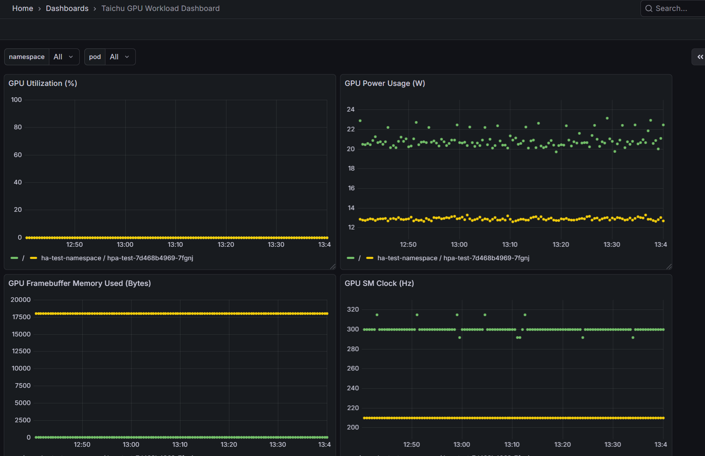

# Monitor GPU Workload Resources on the Taichu Platform

Efficient GPU workload management requires visibility into GPU utilization, memory, and performance **per Pod or container**. Taichu provides automated collection of GPU metrics through the **DCGM exporter**, enabling developers and platform administrators to monitor workloads in real time.

## Prerequisites

- A Taichu Kubernetes cluster with NVIDIA GPUs properly configured and schedulable.
- GPU workloads deployed as Pods or containers to demonstrate metrics collection.

## Key GPU Workload Metrics

| Metric Name                                             | Meaning                                     | Usage Tip                                                    |
| ------------------------------------------------------- | ------------------------------------------- | ------------------------------------------------------------ |
| GPU Utilization (%) (`DCGM_FI_DEV_GPU_UTIL`)            | Fraction of GPU cores used by a workload    | Identify compute-heavy Pods; low utilization may indicate CPU or I/O bottlenecks |
| GPU Power Usage (W) (`DCGM_FI_DEV_POWER_USAGE`)         | Instantaneous GPU power used by workload    | Helps detect throttling or inefficient workloads             |
| Framebuffer Memory Used (Bytes) (`DCGM_FI_DEV_FB_USED`) | GPU memory consumed by workload             | Prevent OOM errors; useful for scheduling decisions          |
| SM Clock (Hz) (`DCGM_FI_DEV_SM_CLOCK`)                  | Streaming Multiprocessor clock per workload | Monitor workload intensity and GPU frequency scaling         |
| Tensor Core Utilization (%) (`DCGM_FI_DEV_TC_UTIL`)     | Active usage of Tensor cores                | Relevant for AI/ML workloads using tensor cores              |

### Interpretation

- **High GPU utilization** with **high Tensor Core utilization** → workload is compute-heavy, expected for AI training.
- **High memory usage with low GPU utilization** → workload is memory-bound or too small to fully leverage GPU.
- **Power usage** → helps identify throttling or inefficient scheduling at the Pod level.
- **SM Clock** → low values under high workload may indicate GPU frequency throttling.

## Figure X: Taichu GPU Workload Dashboard

This Grafana dashboard visualizes GPU workload metrics collected per Pod or container. Panels include:

- **GPU Utilization (%)** – shows fraction of GPU cores used by each Pod.
- **GPU Power Usage (W)** – instantaneous power draw per Pod.
- **GPU Framebuffer Memory Used (Bytes)** – tracks memory usage per workload.
- **GPU SM Clock (Hz)** – monitors SM frequency for workload intensity.
- **Tensor Core Utilization (%)** – measures tensor core usage relevant for AI workloads.

Users can filter metrics by **namespace** and **Pod** using the dashboard variables to focus on specific workloads.

