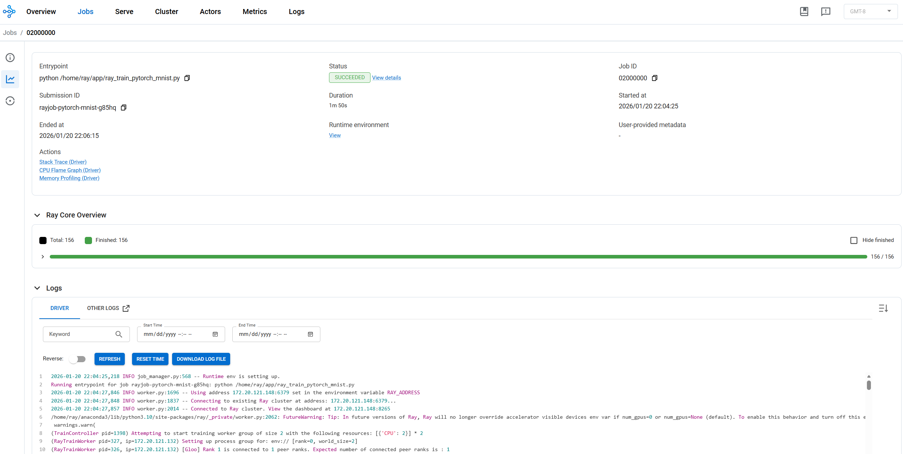

# Configure and deploy a Ray cluster on the Taichu platform

In this article, you will configure and deploy a Ray cluster on the **Taichu Kubernetes platform** using **KubeRay Operator** installed via **Helm**. You will also learn how to use the Ray cluster to train a simple machine learning model and monitor the results on the **Ray Dashboard**.

This article provides two methods to deploy the Ray cluster on Taichu:

- **Manual deployment**: Follow the manual deployment steps to deploy KubeRay Operator and Ray workloads to your Taichu Kubernetes cluster.

## Prerequisites

- Create cluster with Kubernetes version >= 1.34.
- Helm version 3 or above installed.

## Deploy KubeRay Operator

### 1. Install KubeRay Operator using Helm

```
helm install kuberay-operator kuberay/kuberay-operator --version 1.5.1 -n ray-system --create-namespace
```

### 2. Verify the installation

```
(base) root@ai18:~/wode/kuberay-operator# kubectl -n ray-system get pod -w
NAME                                READY   STATUS    RESTARTS   AGE
kuberay-operator-648c7b86f5-vhkbz   1/1     Running   0          57s
```

## Training a PyTorch Model on Fashion MNIST with Ray on the Taichu Platform

Fashion MNIST is a widely used image classification dataset provided by Zalando. It consists of **60,000 training images** and **10,000 test images**, where each sample is a **28×28 grayscale image** labeled as one of **ten clothing categories**.

In this guide, Fashion MNIST is used as a **sample workload** to demonstrate how to run distributed machine learning training on the **Taichu GPU-enabled Kubernetes platform** using **Ray** and **PyTorch**.

The purpose of this example is not to achieve state-of-the-art model accuracy, but to:

- Validate that **Ray clusters deployed on Taichu** function correctly
- Demonstrate **distributed training workflows** with PyTorch on GPUs
- Showcase **GPU scheduling, isolation, and utilization** on the Taichu platform
- Provide a **reproducible and easy-to-understand example** for users getting started with Ray

Because of its small size and simple structure, Fashion MNIST is well suited for platform validation, tutorials, and performance demonstrations on Taichu.

### GPU Ray Job configuration

To run a GPU Ray Job on Taichu, you submit a Ray Job specification to the KubeRay operator installed via Helm. The Ray Job YAML defines the Ray cluster size and the GPU resources required by the job.

Some fields in the Ray Job specification must be adjusted to match the GPU environment:

- The `replicas` field under `workerGroupSpecs` in `rayClusterSpec` specifies the number of Ray worker pods.
   Each worker pod requests **1 NVIDIA GPU**, **3 CPUs**, and **4 GiB memory**.
   The head pod does not request GPU resources.
- The `NUM_WORKERS` field in `runtimeEnvYAML` specifies the number of Ray actors to launch.
   Each Ray actor runs inside one worker pod, so this value **must be less than or equal to** the `replicas` value.
- The `CPUS_PER_WORKER` field must be **less than the CPU limit of a worker pod minus one**.
   In this example, each worker pod has 3 CPUs, so `CPUS_PER_WORKER` is set to 2.
- For GPU workloads, each worker pod is allocated **exactly one GPU** using `nvidia.com/gpu: 1`.
   Ray workers can only access the GPU assigned to their own pod via `NVIDIA_VISIBLE_DEVICES`.

As a result, running a Ray Job with one GPU worker requires **one available GPU on the Taichu cluster**. Ray actors are scheduled only when sufficient GPU resources are available.

#### Launch the PyTorch model training job using the `kubectl apply` command.

```
kubectl -n ray-system apply -f https://raw.githubusercontent.com/ray-project/kuberay/master/ray-operator/config/samples/pytorch-mnist/ray-job.pytorch-mnist.yaml
```

#### Verify the RayJob deployment

```
(base) root@ai18:~/wode/ray-sample# kubectl -n ray-system get pod 
NAME                                                  READY   STATUS    RESTARTS   AGE
kuberay-operator-648c7b86f5-vhkbz                     1/1     Running   0          22h
rayjob-pytorch-mnist-5sr4s                            1/1     Running   0          6s
rayjob-pytorch-mnist-czktk-head-fkkgv                 1/1     Running   0          37s
rayjob-pytorch-mnist-czktk-small-group-worker-lc8hv   1/1     Running   0          36s
rayjob-pytorch-mnist-czktk-small-group-worker-v94gj   1/1     Running   0          37s       
```

#### Verify the RayJob status

```
(base) root@ai18:~/wode/ray-sample# kubectl -n ray-system get rayjobs.ray.io 
NAME                   JOB STATUS   DEPLOYMENT STATUS   RAY CLUSTER NAME             START TIME             END TIME   AGE
rayjob-pytorch-mnist   RUNNING      Running             rayjob-pytorch-mnist-czktk   2026-01-21T06:03:48Z              46s
 
```

#### View the logs of the RayJob using the kubectl logs command
```
(base) root@ai18:~/wode/ray-sample# kubectl -n ray-system logs  rayjob-pytorch-mnist-5sr4s 
2026-01-20 22:04:24,856	INFO cli.py:41 -- Job submission server address: http://rayjob-pytorch-mnist-czktk-head-svc.ray-system.svc.cluster.local:8265
2026-01-20 22:04:25,487	SUCC cli.py:65 -- -------------------------------------------------------
2026-01-20 22:04:25,487	SUCC cli.py:66 -- Job 'rayjob-pytorch-mnist-g85hq' submitted successfully
2026-01-20 22:04:25,487	SUCC cli.py:67 -- -------------------------------------------------------
2026-01-20 22:04:25,487	INFO cli.py:291 -- Next steps
2026-01-20 22:04:25,487	INFO cli.py:292 -- Query the logs of the job:
2026-01-20 22:04:25,488	INFO cli.py:294 -- ray job logs rayjob-pytorch-mnist-g85hq
2026-01-20 22:04:25,488	INFO cli.py:296 -- Query the status of the job:
2026-01-20 22:04:25,488	INFO cli.py:298 -- ray job status rayjob-pytorch-mnist-g85hq
2026-01-20 22:04:25,488	INFO cli.py:300 -- Request the job to be stopped:
2026-01-20 22:04:25,488	INFO cli.py:302 -- ray job stop rayjob-pytorch-mnist-g85hq
2026-01-20 22:04:26,564	INFO cli.py:41 -- Job submission server address: http://rayjob-pytorch-mnist-czktk-head-svc.ray-system.svc.cluster.local:8265
2026-01-20 22:04:25,218	INFO job_manager.py:568 -- Runtime env is setting up.
Running entrypoint for job rayjob-pytorch-mnist-g85hq: python /home/ray/app/ray_train_pytorch_mnist.py
2026-01-20 22:04:27,846	INFO worker.py:1696 -- Using address 172.20.121.148:6379 set in the environment variable RAY_ADDRESS
2026-01-20 22:04:27,848	INFO worker.py:1837 -- Connecting to existing Ray cluster at address: 172.20.121.148:6379...
2026-01-20 22:04:27,857	INFO worker.py:2014 -- Connected to Ray cluster. View the dashboard at 172.20.121.148:8265 
/home/ray/anaconda3/lib/python3.10/site-packages/ray/_private/worker.py:2062: FutureWarning: Tip: In future versions of Ray, Ray will no longer override accelerator visible devices env var if num_gpus=0 or num_gpus=None (default). To enable this behavior and turn off this error message, set RAY_ACCEL_ENV_VAR_OVERRIDE_ON_ZERO=0
  warnings.warn(
(TrainController pid=1398) Attempting to start training worker group of size 2 with the following resources: [{'CPU': 2}] * 2
(RayTrainWorker pid=327, ip=172.20.121.132) Setting up process group for: env:// [rank=0, world_size=2]
(RayTrainWorker pid=326, ip=172.20.121.132) [Gloo] Rank 1 is connected to 1 peer ranks. Expected number of connected peer ranks is : 1
(TrainController pid=1398) Started training worker group of size 2: 
(TrainController pid=1398) - (ip=172.20.121.132, pid=327) world_rank=0, local_rank=0, node_rank=0
(TrainController pid=1398) - (ip=172.20.121.132, pid=326) world_rank=1, local_rank=1, node_rank=0
(RayTrainWorker pid=327, ip=172.20.121.132) Moving model to device: cpu
(RayTrainWorker pid=327, ip=172.20.121.132) Wrapping provided model in DistributedDataParallel.
(RayTrainWorker pid=326, ip=172.20.121.132) 
Train Epoch 0:   0%|          | 0/1875 [00:00<?, ?it/s]
(RayTrainWorker pid=326, ip=172.20.121.132) 
Train Epoch 0:   1%|          | 20/1875 [00:00<00:09, 198.50it/s]
(RayTrainWorker pid=327, ip=172.20.121.132) 
Train Epoch 0:   0%|          | 0/1875 [00:00<?, ?it/s]
(RayTrainWorker pid=326, ip=172.20.121.132) 
Train Epoch 0:  53%|█████▎    | 985/1875 [00:05<00:04, 193.34it/s] [repeated 96x across cluster] (Ray deduplicates logs by default. Set RAY_DEDUP_LOGS=0 to disable log deduplication, or see https://docs.ray.io/en/master/ray-observability/user-guides/configure-logging.html#log-deduplication for more options.)
(RayTrainWorker pid=327, ip=172.20.121.132) [Gloo] Rank 0 is connected to 1 peer ranks. Expected number of connected peer ranks is : 1
(RayTrainWorker pid=326, ip=172.20.121.132) 
Train Epoch 0:  92%|█████████▏| 1730/1875 [00:08<00:00, 200.28it/s]
(RayTrainWorker pid=326, ip=172.20.121.132) 
Test Epoch 0:   0%|          | 0/313 [00:00<?, ?it/s]
(RayTrainWorker pid=326, ip=172.20.121.132) 
Test Epoch 0:  24%|██▍       | 75/313 [00:00<00:00, 741.27it/s]
(RayTrainWorker pid=326, ip=172.20.121.132) 
Test Epoch 0:  98%|█████████▊| 307/313 [00:00<00:00, 749.87it/s]
Test Epoch 0: 100%|██████████| 313/313 [00:00<00:00, 750.73it/s]
(RayTrainWorker pid=326, ip=172.20.121.132) Reporting training result 1: TrainingReport(checkpoint=None, metrics={'loss': 0.55425636098979, 'accuracy': 0.7994}, validation_spec=None)
(RayTrainWorker pid=326, ip=172.20.121.132) 
Train Epoch 1:   0%|          | 0/1875 [00:00<?, ?it/s]
(RayTrainWorker pid=327, ip=172.20.121.132) 
Train Epoch 0:  91%|█████████ | 1708/1875 [00:08<00:00, 196.31it/s] [repeated 71x across cluster]
(RayTrainWorker pid=327, ip=172.20.121.132) 
Test Epoch 0: 100%|██████████| 313/313 [00:00<00:00, 793.94it/s]
(RayTrainWorker pid=327, ip=172.20.121.132) 
Train Epoch 0: 100%|██████████| 1875/1875 [00:09<00:00, 193.04it/s] [repeated 17x across cluster]
(RayTrainWorker pid=327, ip=172.20.121.132) 
Test Epoch 0:   0%|          | 0/313 [00:00<?, ?it/s]
(RayTrainWorker pid=327, ip=172.20.121.132) 
Test Epoch 0:  76%|███████▌  | 238/313 [00:00<00:00, 777.25it/s] [repeated 5x across cluster]
(RayTrainWorker pid=327, ip=172.20.121.132) Reporting training result 1: TrainingReport(checkpoint=None, metrics={'loss': 0.5299808326334999, 'accuracy': 0.805}, validation_spec=None)
(RayTrainWorker pid=327, ip=172.20.121.132) 
Train Epoch 1:   0%|          | 0/1875 [00:00<?, ?it/s]
(RayTrainWorker pid=326, ip=172.20.121.132) 
Train Epoch 1:  53%|█████▎    | 998/1875 [00:05<00:04, 194.57it/s] [repeated 95x across cluster]
(RayTrainWorker pid=326, ip=172.20.121.132) 
Train Epoch 1:  93%|█████████▎| 1739/1875 [00:08<00:00, 198.25it/s] [repeated 3x across cluster]
(RayTrainWorker pid=326, ip=172.20.121.132) 
Test Epoch 1:   0%|          | 0/313 [00:00<?, ?it/s]
(RayTrainWorker pid=326, ip=172.20.121.132) 
Test Epoch 1:  46%|████▌     | 144/313 [00:00<00:00, 726.17it/s] [repeated 3x across cluster]
(RayTrainWorker pid=326, ip=172.20.121.132) 
Test Epoch 1:  94%|█████████▍| 295/313 [00:00<00:00, 736.38it/s]
Test Epoch 1: 100%|██████████| 313/313 [00:00<00:00, 738.32it/s]
(RayTrainWorker pid=326, ip=172.20.121.132) Reporting training result 2: TrainingReport(checkpoint=None, metrics={'loss': 0.48128968461776694, 'accuracy': 0.826}, validation_spec=None)
(RayTrainWorker pid=326, ip=172.20.121.132) 
Train Epoch 2:   0%|          | 0/1875 [00:00<?, ?it/s]
(RayTrainWorker pid=327, ip=172.20.121.132) 
Test Epoch 1: 100%|██████████| 313/313 [00:00<00:00, 783.73it/s]
(RayTrainWorker pid=326, ip=172.20.121.132) 
Train Epoch 2:   1%|          | 21/1875 [00:00<00:09, 204.25it/s] [repeated 70x across cluster]
(RayTrainWorker pid=327, ip=172.20.121.132) 
Train Epoch 1: 100%|██████████| 1875/1875 [00:09<00:00, 197.47it/s] [repeated 15x across cluster]
(RayTrainWorker pid=327, ip=172.20.121.132) 
Test Epoch 1:   0%|          | 0/313 [00:00<?, ?it/s]
(RayTrainWorker pid=327, ip=172.20.121.132) 
Test Epoch 1:  76%|███████▌  | 238/313 [00:00<00:00, 796.55it/s] [repeated 3x across cluster]
(RayTrainWorker pid=327, ip=172.20.121.132) Reporting training result 2: TrainingReport(checkpoint=None, metrics={'loss': 0.4660623833394279, 'accuracy': 0.827}, validation_spec=None)
(RayTrainWorker pid=327, ip=172.20.121.132) 
Train Epoch 2:   0%|          | 0/1875 [00:00<?, ?it/s]
(RayTrainWorker pid=326, ip=172.20.121.132) 
Train Epoch 2:  55%|█████▍    | 1022/1875 [00:05<00:04, 189.51it/s] [repeated 96x across cluster]
(RayTrainWorker pid=326, ip=172.20.121.132) 
Train Epoch 2:  94%|█████████▍| 1759/1875 [00:08<00:00, 194.04it/s] [repeated 5x across cluster]
(RayTrainWorker pid=326, ip=172.20.121.132) 
Test Epoch 2:   0%|          | 0/313 [00:00<?, ?it/s]
(RayTrainWorker pid=326, ip=172.20.121.132) 
Test Epoch 2:  74%|███████▍  | 232/313 [00:00<00:00, 772.79it/s] [repeated 5x across cluster]
(RayTrainWorker pid=326, ip=172.20.121.132) 
Test Epoch 2:  99%|█████████▉| 311/313 [00:00<00:00, 778.13it/s]
Test Epoch 2: 100%|██████████| 313/313 [00:00<00:00, 777.06it/s]
(RayTrainWorker pid=326, ip=172.20.121.132) Reporting training result 3: TrainingReport(checkpoint=None, metrics={'loss': 0.4439943903825058, 'accuracy': 0.8444}, validation_spec=None)
(RayTrainWorker pid=326, ip=172.20.121.132) 
Train Epoch 3:   0%|          | 0/1875 [00:00<?, ?it/s]
(RayTrainWorker pid=327, ip=172.20.121.132) 
Test Epoch 2: 100%|██████████| 313/313 [00:00<00:00, 776.67it/s]
(RayTrainWorker pid=326, ip=172.20.121.132) 
Train Epoch 3:   2%|▏         | 38/1875 [00:00<00:10, 183.17it/s] [repeated 70x across cluster]
(RayTrainWorker pid=327, ip=172.20.121.132) 
Train Epoch 2: 100%|██████████| 1875/1875 [00:09<00:00, 197.17it/s] [repeated 13x across cluster]
(RayTrainWorker pid=327, ip=172.20.121.132) 
Test Epoch 2:   0%|          | 0/313 [00:00<?, ?it/s]
(RayTrainWorker pid=327, ip=172.20.121.132) 
Test Epoch 2:  77%|███████▋  | 242/313 [00:00<00:00, 762.33it/s]
(RayTrainWorker pid=327, ip=172.20.121.132) Reporting training result 3: TrainingReport(checkpoint=None, metrics={'loss': 0.42722287982964097, 'accuracy': 0.8436}, validation_spec=None)
(RayTrainWorker pid=327, ip=172.20.121.132) 
Train Epoch 3:   0%|          | 0/1875 [00:00<?, ?it/s]
(RayTrainWorker pid=326, ip=172.20.121.132) 
Train Epoch 3:  54%|█████▍    | 1015/1875 [00:05<00:04, 192.68it/s] [repeated 96x across cluster]
(RayTrainWorker pid=326, ip=172.20.121.132) 
Train Epoch 3:  92%|█████████▏| 1721/1875 [00:08<00:00, 198.32it/s] [repeated 2x across cluster]
(RayTrainWorker pid=326, ip=172.20.121.132) 
Train Epoch 3: 100%|█████████▉| 1866/1875 [00:09<00:00, 199.83it/s]
Train Epoch 3: 100%|██████████| 1875/1875 [00:09<00:00, 192.92it/s]
(RayTrainWorker pid=326, ip=172.20.121.132) 
Test Epoch 3:   0%|          | 0/313 [00:00<?, ?it/s]
(RayTrainWorker pid=326, ip=172.20.121.132) 
Test Epoch 3:  24%|██▍       | 75/313 [00:00<00:00, 741.79it/s]
(RayTrainWorker pid=326, ip=172.20.121.132) 
Test Epoch 3:  98%|█████████▊| 308/313 [00:00<00:00, 768.03it/s]
Test Epoch 3: 100%|██████████| 313/313 [00:00<00:00, 766.09it/s]
(RayTrainWorker pid=326, ip=172.20.121.132) Reporting training result 4: TrainingReport(checkpoint=None, metrics={'loss': 0.43300952571935164, 'accuracy': 0.8412}, validation_spec=None)
(RayTrainWorker pid=326, ip=172.20.121.132) 
Train Epoch 4:   0%|          | 0/1875 [00:00<?, ?it/s]
(RayTrainWorker pid=327, ip=172.20.121.132) 
Test Epoch 3: 100%|██████████| 313/313 [00:00<00:00, 766.10it/s]
(RayTrainWorker pid=326, ip=172.20.121.132) 
Train Epoch 4:   1%|          | 19/1875 [00:00<00:10, 175.63it/s] [repeated 70x across cluster]
(RayTrainWorker pid=327, ip=172.20.121.132) 
Train Epoch 3:  98%|█████████▊| 1843/1875 [00:09<00:00, 198.95it/s] [repeated 12x across cluster]
(RayTrainWorker pid=327, ip=172.20.121.132) 
Train Epoch 3:  99%|█████████▉| 1863/1875 [00:09<00:00, 198.55it/s]
Train Epoch 3: 100%|██████████| 1875/1875 [00:09<00:00, 192.92it/s]
(RayTrainWorker pid=327, ip=172.20.121.132) 
Test Epoch 3:   0%|          | 0/313 [00:00<?, ?it/s]
(RayTrainWorker pid=327, ip=172.20.121.132) 
Test Epoch 3:  74%|███████▍  | 233/313 [00:00<00:00, 744.31it/s] [repeated 5x across cluster]
(RayTrainWorker pid=327, ip=172.20.121.132) Reporting training result 4: TrainingReport(checkpoint=None, metrics={'loss': 0.419054349759421, 'accuracy': 0.8484}, validation_spec=None)
(RayTrainWorker pid=327, ip=172.20.121.132) 
Train Epoch 4:   0%|          | 0/1875 [00:00<?, ?it/s]
(RayTrainWorker pid=326, ip=172.20.121.132) 
Train Epoch 4:  54%|█████▍    | 1020/1875 [00:05<00:04, 191.61it/s] [repeated 96x across cluster]
(RayTrainWorker pid=326, ip=172.20.121.132) 
Train Epoch 4:  94%|█████████▎| 1757/1875 [00:08<00:00, 189.64it/s] [repeated 5x across cluster]
(RayTrainWorker pid=326, ip=172.20.121.132) 
Test Epoch 4:   0%|          | 0/313 [00:00<?, ?it/s]
(RayTrainWorker pid=326, ip=172.20.121.132) 
Test Epoch 4:  49%|████▉     | 154/313 [00:00<00:00, 766.24it/s] [repeated 3x across cluster]
(RayTrainWorker pid=326, ip=172.20.121.132) 
Test Epoch 4:  99%|█████████▉| 310/313 [00:00<00:00, 773.51it/s]
Test Epoch 4: 100%|██████████| 313/313 [00:00<00:00, 774.04it/s]
(RayTrainWorker pid=326, ip=172.20.121.132) Reporting training result 5: TrainingReport(checkpoint=None, metrics={'loss': 0.4091721838488937, 'accuracy': 0.855}, validation_spec=None)
(RayTrainWorker pid=326, ip=172.20.121.132) 
Train Epoch 5:   0%|          | 0/1875 [00:00<?, ?it/s]
(RayTrainWorker pid=327, ip=172.20.121.132) 
Test Epoch 4: 100%|██████████| 313/313 [00:00<00:00, 795.27it/s]
(RayTrainWorker pid=326, ip=172.20.121.132) 
Train Epoch 5:   2%|▏         | 44/1875 [00:00<00:10, 180.08it/s] [repeated 70x across cluster]
(RayTrainWorker pid=327, ip=172.20.121.132) 
Train Epoch 4: 100%|██████████| 1875/1875 [00:09<00:00, 196.85it/s] [repeated 13x across cluster]
(RayTrainWorker pid=327, ip=172.20.121.132) 
Test Epoch 4:   0%|          | 0/313 [00:00<?, ?it/s]
(RayTrainWorker pid=327, ip=172.20.121.132) 
Test Epoch 4:  77%|███████▋  | 241/313 [00:00<00:00, 785.33it/s] [repeated 3x across cluster]
(RayTrainWorker pid=327, ip=172.20.121.132) Reporting training result 5: TrainingReport(checkpoint=None, metrics={'loss': 0.39389231487418325, 'accuracy': 0.858}, validation_spec=None)
(RayTrainWorker pid=327, ip=172.20.121.132) 
Train Epoch 5:   0%|          | 0/1875 [00:00<?, ?it/s]
(RayTrainWorker pid=326, ip=172.20.121.132) 
Train Epoch 5:  55%|█████▌    | 1033/1875 [00:05<00:04, 200.80it/s] [repeated 96x across cluster]
(RayTrainWorker pid=326, ip=172.20.121.132) 
Train Epoch 5:  93%|█████████▎| 1746/1875 [00:08<00:00, 197.43it/s] [repeated 3x across cluster]
(RayTrainWorker pid=326, ip=172.20.121.132) 
Train Epoch 5: 100%|█████████▉| 1870/1875 [00:09<00:00, 198.93it/s]
Train Epoch 5: 100%|██████████| 1875/1875 [00:09<00:00, 195.78it/s]
(RayTrainWorker pid=326, ip=172.20.121.132) 
Test Epoch 5:   0%|          | 0/313 [00:00<?, ?it/s]
(RayTrainWorker pid=326, ip=172.20.121.132) 
Test Epoch 5:  47%|████▋     | 148/313 [00:00<00:00, 738.25it/s] [repeated 3x across cluster]
(RayTrainWorker pid=326, ip=172.20.121.132) 
Test Epoch 5:  97%|█████████▋| 305/313 [00:00<00:00, 765.45it/s]
Test Epoch 5: 100%|██████████| 313/313 [00:00<00:00, 761.86it/s]
(RayTrainWorker pid=326, ip=172.20.121.132) Reporting training result 6: TrainingReport(checkpoint=None, metrics={'loss': 0.402862713327066, 'accuracy': 0.851}, validation_spec=None)
(RayTrainWorker pid=326, ip=172.20.121.132) 
Train Epoch 6:   0%|          | 0/1875 [00:00<?, ?it/s]
(RayTrainWorker pid=327, ip=172.20.121.132) 
Test Epoch 5: 100%|██████████| 313/313 [00:00<00:00, 797.07it/s]
(RayTrainWorker pid=326, ip=172.20.121.132) 
Train Epoch 6:   3%|▎         | 63/1875 [00:00<00:08, 204.90it/s] [repeated 72x across cluster]
(RayTrainWorker pid=327, ip=172.20.121.132) 
Train Epoch 5:  99%|█████████▊| 1849/1875 [00:09<00:00, 197.75it/s] [repeated 11x across cluster]
(RayTrainWorker pid=327, ip=172.20.121.132) 
Train Epoch 5: 100%|█████████▉| 1870/1875 [00:09<00:00, 198.91it/s]
Train Epoch 5: 100%|██████████| 1875/1875 [00:09<00:00, 195.78it/s]
(RayTrainWorker pid=327, ip=172.20.121.132) 
Test Epoch 5:   0%|          | 0/313 [00:00<?, ?it/s]
(RayTrainWorker pid=327, ip=172.20.121.132) 
Test Epoch 5:  76%|███████▌  | 238/313 [00:00<00:00, 787.92it/s] [repeated 3x across cluster]
(RayTrainWorker pid=327, ip=172.20.121.132) Reporting training result 6: TrainingReport(checkpoint=None, metrics={'loss': 0.3843741780994966, 'accuracy': 0.8618}, validation_spec=None)
(RayTrainWorker pid=327, ip=172.20.121.132) 
Train Epoch 6:   0%|          | 0/1875 [00:00<?, ?it/s]
(RayTrainWorker pid=326, ip=172.20.121.132) 
Train Epoch 6:  56%|█████▌    | 1053/1875 [00:05<00:04, 190.62it/s] [repeated 96x across cluster]
(RayTrainWorker pid=326, ip=172.20.121.132) 
Train Epoch 6:  96%|█████████▌| 1795/1875 [00:09<00:00, 199.32it/s] [repeated 9x across cluster]
(RayTrainWorker pid=326, ip=172.20.121.132) 
Test Epoch 6:   0%|          | 0/313 [00:00<?, ?it/s]
(RayTrainWorker pid=326, ip=172.20.121.132) 
Test Epoch 6:  99%|█████████▉| 311/313 [00:00<00:00, 762.11it/s]
Test Epoch 6: 100%|██████████| 313/313 [00:00<00:00, 765.60it/s]
(RayTrainWorker pid=326, ip=172.20.121.132) Reporting training result 7: TrainingReport(checkpoint=None, metrics={'loss': 0.3913995736358931, 'accuracy': 0.859}, validation_spec=None)
(RayTrainWorker pid=326, ip=172.20.121.132) 
Train Epoch 7:   0%|          | 0/1875 [00:00<?, ?it/s]
(RayTrainWorker pid=327, ip=172.20.121.132) 
Test Epoch 6:  74%|███████▍  | 233/313 [00:00<00:00, 770.93it/s] [repeated 6x across cluster]
(RayTrainWorker pid=327, ip=172.20.121.132) 
Test Epoch 6: 100%|██████████| 313/313 [00:00<00:00, 779.24it/s]
(RayTrainWorker pid=326, ip=172.20.121.132) 
Train Epoch 7:   6%|▌         | 105/1875 [00:00<00:08, 198.13it/s] [repeated 72x across cluster]
(RayTrainWorker pid=327, ip=172.20.121.132) 
Train Epoch 6: 100%|██████████| 1875/1875 [00:09<00:00, 197.05it/s] [repeated 9x across cluster]
(RayTrainWorker pid=327, ip=172.20.121.132) 
Test Epoch 6:   0%|          | 0/313 [00:00<?, ?it/s]
(RayTrainWorker pid=327, ip=172.20.121.132) Reporting training result 7: TrainingReport(checkpoint=None, metrics={'loss': 0.37101868637644064, 'accuracy': 0.8666}, validation_spec=None)
(RayTrainWorker pid=327, ip=172.20.121.132) 
Train Epoch 7:   0%|          | 0/1875 [00:00<?, ?it/s]
(RayTrainWorker pid=326, ip=172.20.121.132) 
Train Epoch 7:  57%|█████▋    | 1075/1875 [00:05<00:04, 199.46it/s] [repeated 94x across cluster]
(RayTrainWorker pid=326, ip=172.20.121.132) 
Train Epoch 7:  96%|█████████▌| 1803/1875 [00:09<00:00, 199.40it/s] [repeated 9x across cluster]
(RayTrainWorker pid=326, ip=172.20.121.132) 
Train Epoch 7: 100%|█████████▉| 1866/1875 [00:09<00:00, 200.24it/s]
Train Epoch 7: 100%|██████████| 1875/1875 [00:09<00:00, 196.88it/s]
(RayTrainWorker pid=326, ip=172.20.121.132) 
Test Epoch 7:   0%|          | 0/313 [00:00<?, ?it/s]
(RayTrainWorker pid=326, ip=172.20.121.132) 
Test Epoch 7:  25%|██▍       | 78/313 [00:00<00:00, 772.87it/s]
(RayTrainWorker pid=326, ip=172.20.121.132) 
Test Epoch 7: 100%|██████████| 313/313 [00:00<00:00, 765.09it/s]
Test Epoch 7: 100%|██████████| 313/313 [00:00<00:00, 769.09it/s]
(RayTrainWorker pid=326, ip=172.20.121.132) Reporting training result 8: TrainingReport(checkpoint=None, metrics={'loss': 0.38363589075045845, 'accuracy': 0.859}, validation_spec=None)
(RayTrainWorker pid=326, ip=172.20.121.132) 
Train Epoch 8:   0%|          | 0/1875 [00:00<?, ?it/s]
(RayTrainWorker pid=327, ip=172.20.121.132) 
Test Epoch 7: 100%|██████████| 313/313 [00:00<00:00, 802.93it/s]
(RayTrainWorker pid=326, ip=172.20.121.132) 
Train Epoch 8:   6%|▌         | 104/1875 [00:00<00:09, 196.22it/s] [repeated 72x across cluster]
(RayTrainWorker pid=327, ip=172.20.121.132) 
Train Epoch 7:  98%|█████████▊| 1845/1875 [00:09<00:00, 201.04it/s] [repeated 5x across cluster]
(RayTrainWorker pid=327, ip=172.20.121.132) 
Train Epoch 7: 100%|█████████▉| 1866/1875 [00:09<00:00, 200.25it/s]
Train Epoch 7: 100%|██████████| 1875/1875 [00:09<00:00, 196.88it/s]
(RayTrainWorker pid=327, ip=172.20.121.132) 
Test Epoch 7:   0%|          | 0/313 [00:00<?, ?it/s]
(RayTrainWorker pid=327, ip=172.20.121.132) 
Test Epoch 7:  79%|███████▉  | 248/313 [00:00<00:00, 803.34it/s] [repeated 5x across cluster]
(RayTrainWorker pid=327, ip=172.20.121.132) Reporting training result 8: TrainingReport(checkpoint=None, metrics={'loss': 0.3653381906149272, 'accuracy': 0.8674}, validation_spec=None)
(RayTrainWorker pid=327, ip=172.20.121.132) 
Train Epoch 8:   0%|          | 0/1875 [00:00<?, ?it/s]
(RayTrainWorker pid=326, ip=172.20.121.132) 
Train Epoch 8:  58%|█████▊    | 1087/1875 [00:05<00:04, 196.55it/s] [repeated 96x across cluster]
(RayTrainWorker pid=326, ip=172.20.121.132) 
Train Epoch 8:  97%|█████████▋| 1827/1875 [00:09<00:00, 201.77it/s] [repeated 11x across cluster]
(RayTrainWorker pid=326, ip=172.20.121.132) 
Train Epoch 8: 100%|█████████▉| 1868/1875 [00:09<00:00, 190.58it/s]
Train Epoch 8: 100%|██████████| 1875/1875 [00:09<00:00, 195.82it/s]
(RayTrainWorker pid=326, ip=172.20.121.132) 
Test Epoch 8:   0%|          | 0/313 [00:00<?, ?it/s]
(RayTrainWorker pid=326, ip=172.20.121.132) 
Test Epoch 8:  25%|██▌       | 79/313 [00:00<00:00, 788.30it/s]
(RayTrainWorker pid=327, ip=172.20.121.132) 
Test Epoch 8:  26%|██▌       | 81/313 [00:00<00:00, 806.66it/s]
(RayTrainWorker pid=326, ip=172.20.121.132) 
Test Epoch 8: 100%|██████████| 313/313 [00:00<00:00, 789.34it/s]
(RayTrainWorker pid=326, ip=172.20.121.132) Reporting training result 9: TrainingReport(checkpoint=None, metrics={'loss': 0.3713215762100662, 'accuracy': 0.8662}, validation_spec=None)
(RayTrainWorker pid=326, ip=172.20.121.132) 
Train Epoch 9:   0%|          | 0/1875 [00:00<?, ?it/s]
(RayTrainWorker pid=326, ip=172.20.121.132) 
Train Epoch 9:   7%|▋         | 123/1875 [00:00<00:09, 193.75it/s] [repeated 72x across cluster]
(RayTrainWorker pid=327, ip=172.20.121.132) 
Train Epoch 8:  99%|█████████▊| 1848/1875 [00:09<00:00, 193.29it/s] [repeated 3x across cluster]
(RayTrainWorker pid=327, ip=172.20.121.132) 
Train Epoch 8: 100%|█████████▉| 1868/1875 [00:09<00:00, 190.70it/s]
Train Epoch 8: 100%|██████████| 1875/1875 [00:09<00:00, 195.83it/s]
(RayTrainWorker pid=327, ip=172.20.121.132) 
Test Epoch 8:   0%|          | 0/313 [00:00<?, ?it/s]
(RayTrainWorker pid=327, ip=172.20.121.132) 
Test Epoch 8:  78%|███████▊  | 244/313 [00:00<00:00, 801.36it/s] [repeated 4x across cluster]
(RayTrainWorker pid=327, ip=172.20.121.132) 
Test Epoch 8: 100%|██████████| 313/313 [00:00<00:00, 791.90it/s]
(RayTrainWorker pid=327, ip=172.20.121.132) Reporting training result 9: TrainingReport(checkpoint=None, metrics={'loss': 0.36168192828240725, 'accuracy': 0.872}, validation_spec=None)
(RayTrainWorker pid=327, ip=172.20.121.132) 
Train Epoch 9:   0%|          | 0/1875 [00:00<?, ?it/s]
(RayTrainWorker pid=326, ip=172.20.121.132) 
Train Epoch 9:  59%|█████▉    | 1108/1875 [00:05<00:03, 192.36it/s] [repeated 96x across cluster]
(RayTrainWorker pid=326, ip=172.20.121.132) 
Train Epoch 9:  99%|█████████▉| 1862/1875 [00:09<00:00, 190.77it/s]
Train Epoch 9: 100%|██████████| 1875/1875 [00:09<00:00, 195.31it/s]
(RayTrainWorker pid=326, ip=172.20.121.132) 
Test Epoch 9:   0%|          | 0/313 [00:00<?, ?it/s]
(RayTrainWorker pid=327, ip=172.20.121.132) 
Train Epoch 9:  98%|█████████▊| 1842/1875 [00:09<00:00, 189.65it/s] [repeated 14x across cluster]
(RayTrainWorker pid=326, ip=172.20.121.132) 
Test Epoch 9:  74%|███████▍  | 231/313 [00:00<00:00, 772.49it/s] [repeated 5x across cluster]
(RayTrainWorker pid=326, ip=172.20.121.132) 
Test Epoch 9:  99%|█████████▊| 309/313 [00:00<00:00, 764.37it/s]
Test Epoch 9: 100%|██████████| 313/313 [00:00<00:00, 765.97it/s]
(RayTrainWorker pid=326, ip=172.20.121.132) Reporting training result 10: TrainingReport(checkpoint=None, metrics={'loss': 0.3714044097686014, 'accuracy': 0.8662}, validation_spec=None)
(RayTrainWorker pid=327, ip=172.20.121.132) 
Test Epoch 9: 100%|██████████| 313/313 [00:00<00:00, 805.93it/s]
Training result: Result(metrics=None, checkpoint=None, error=None, path='/home/ray/ray_results/ray_train_run-2026-01-20_22-04-27', metrics_dataframe=None, best_checkpoints=[], _storage_filesystem=<pyarrow._fs.LocalFileSystem object at 0x7b21cc69bcb0>)
(RayTrainWorker pid=327, ip=172.20.121.132) 
Train Epoch 9:  91%|█████████ | 1701/1875 [00:08<00:00, 202.79it/s] [repeated 59x across cluster]
(RayTrainWorker pid=327, ip=172.20.121.132) 
Train Epoch 9:  99%|█████████▉| 1862/1875 [00:09<00:00, 190.75it/s]
Train Epoch 9: 100%|██████████| 1875/1875 [00:09<00:00, 195.31it/s]
(RayTrainWorker pid=327, ip=172.20.121.132) 
Test Epoch 9:   0%|          | 0/313 [00:00<?, ?it/s]
(RayTrainWorker pid=327, ip=172.20.121.132) 
Test Epoch 9:  77%|███████▋  | 240/313 [00:00<00:00, 805.77it/s]
(RayTrainWorker pid=327, ip=172.20.121.132) Reporting training result 10: TrainingReport(checkpoint=None, metrics={'loss': 0.3566941381923069, 'accuracy': 0.8732}, validation_spec=None)
2026-01-20 22:06:20,736	SUCC cli.py:65 -- ------------------------------------------
2026-01-20 22:06:20,737	SUCC cli.py:66 -- Job 'rayjob-pytorch-mnist-g85hq' succeeded
2026-01-20 22:06:20,737	SUCC cli.py:67 -- ------------------------------------------
(base) root@ai18:~/wode/ray-sample# 

```

#### Verify Results
```
(base) root@ai18:~/wode/ray-sample# kubectl -n ray-system get rayjobs.ray.io 
NAME                   JOB STATUS   DEPLOYMENT STATUS   RAY CLUSTER NAME             START TIME             END TIME               AGE
rayjob-pytorch-mnist   SUCCEEDED    Complete            rayjob-pytorch-mnist-czktk   2026-01-21T06:03:48Z   2026-01-21T06:06:24Z   11m
(base) root@ai18:~/wode/ray-sample# kubectl -n ray-system get pod
NAME                                                  READY   STATUS      RESTARTS   AGE
kuberay-operator-648c7b86f5-vhkbz                     1/1     Running     0          22h
rayjob-pytorch-mnist-5sr4s                            0/1     Completed   0          11m
rayjob-pytorch-mnist-czktk-head-fkkgv                 1/1     Running     0          11m
rayjob-pytorch-mnist-czktk-small-group-worker-lc8hv   1/1     Running     0          11m
rayjob-pytorch-mnist-czktk-small-group-worker-v94gj   1/1     Running     0          11m
(base) root@ai18:~/wode/ray-sample# 
```

#### View training results on the Ray Dashboard

Create the service shim to expose the Ray head service on port 80 using the kubectl expose service command.
```
kubectl -n ray-system expose service rayjob-pytorch-mnist-czktk-head-svc \
--port=8265 \
--target-port=8265 \
--type=NodePort \
--name=ray-dash-access
```

Access the Ray dashboard by visiting http://<node-ip>:<node-port> in your web browser.


